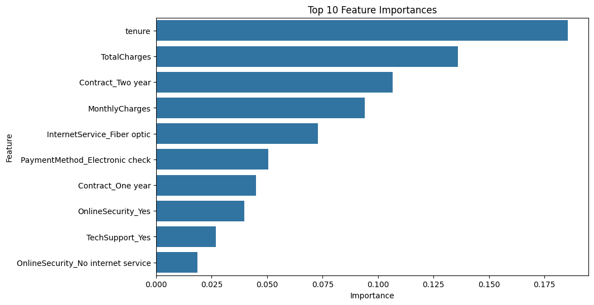

# Customer Churn Prediction

This project builds a machine learning model to predict customer churn using behavioral and account-level features. The objective is to identify high-risk customers and support data-driven retention strategies.

---

## Project Overview

Customer churn is a critical issue in subscription-based businesses. Predicting which customers are likely to leave allows companies to take proactive action and reduce revenue loss.

This project focuses on:
- Understanding churn patterns in customer data  
- Building a classification model to predict churn  
- Identifying key features influencing customer behavior  
- Translating model outputs into business recommendations  

---

## Dataset

- Source: Telco Customer Churn dataset (Kaggle)  
- Contains customer demographics, service usage, and billing information  

Target variable:
- Churn (Yes / No)

---

## Methodology

### Data Cleaning
- Removed missing values  
- Converted data types  
- Filtered invalid or inconsistent records  

### Feature Engineering
- Encoded categorical variables  
- Prepared features for model input  

### Model Building
- Algorithm: Random Forest Classifier  
- Applied train-test split  
- Trained model to classify churn  

### Evaluation
- Evaluated model performance using accuracy  
- Extracted feature importance for interpretation  

---

## Key Insights

- Customers with low tenure are more likely to churn  
- Monthly charges are strongly associated with churn behavior  
- Contract type is a major determinant of retention  
- Customer value and engagement patterns influence churn risk  

---

## Feature Importance

Top drivers of churn (Random Forest):

- Tenure  
- Total Charges  
- Contract Type  
- Monthly Charges  
- Internet Service  

---

## Business Recommendations

- Focus retention efforts on new customers  
- Encourage long-term contracts  
- Monitor customers with high monthly charges  
- Improve service quality for high-value users  
- Use model predictions to target at-risk customers proactively  

---

## Project Structure

customer-churn-prediction/  
├── churn_analysis.ipynb  
├── feature_importance.png  
├── README.md  

---

## Future Improvements

- Add ROC-AUC and precision/recall evaluation  
- Perform hyperparameter tuning  
- Explore advanced models (e.g., gradient boosting)  
- Deploy the model as an application  

---

## Summary

This project demonstrates how machine learning can be applied to predict customer churn and generate actionable business insights. The approach combines data analysis, modeling, and interpretation to support retention strategies.
